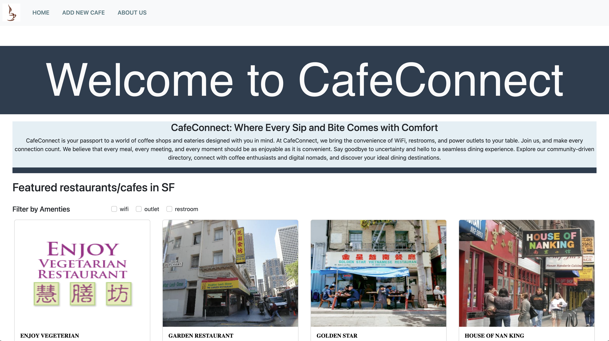
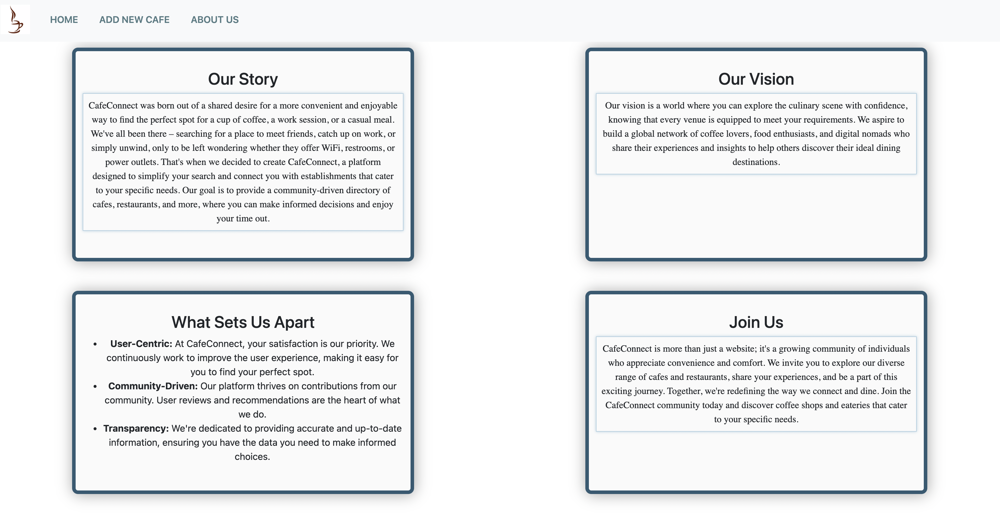
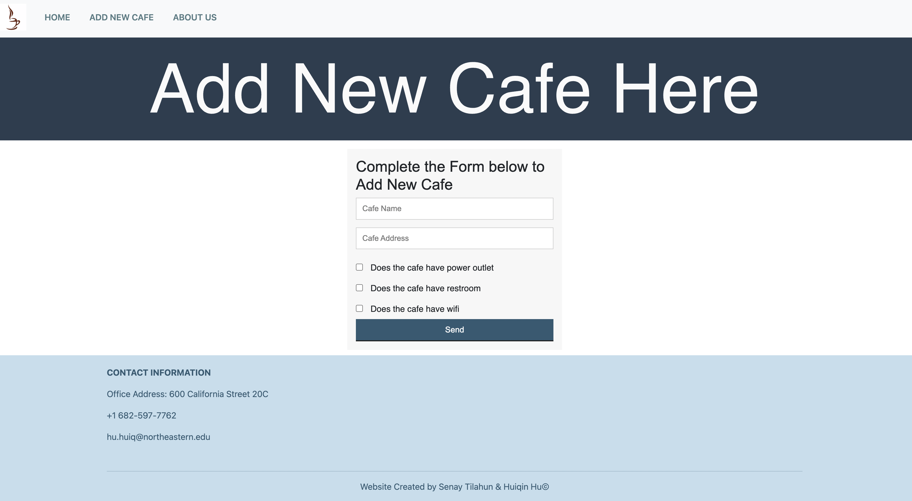

# CafeConnect

CafeConnect is your go-to platform for discovering restaurants with essential amenities, catering to digital nomads, students, and anyone seeking a place to get wifi access, use restroom, or charge their phone. An important feature is a database of restaurants in the Chinatown, San Francisco area on the front page, with key information displayed. It will also have a form to let users add information about new restaurants in the area, and a form to let users update those key attributes (wifi, power outlet, restroom) for existing restaurants in the database.

Created by Senay Tilahun & Huiqin Hu

Slides Link: https://docs.google.com/presentation/d/1TQJIIyhK1SATXGa7glXu7vKPTHJdtsIZ0w3QTDOmchg/edit?usp=sharing

The design document is available at [here](./design-document.md)

## Screenshots







## Class reference

Link: https://johnguerra.co/classes/webDevelopment_fall_2023/

## Demo

Authors:
Huiqin Hu && Senay Tilahun

You can visit the live website here: coming soon ...

## Installation

To set up CafeConnect, you'll need the following dependencies:

Clone the repository:

```
git clone https://github.com/senay-tilahun/CafeConnect
```

Navigate to the root directory:

```
cd cafeconnect
```

### Dependencies:

```
- Node.js
- express: ^4.18.2
- mongodb: ^6.1.0
```

To install these dependencies, you can run the following command once you've cloned the repo:

```
npm install
```

Start the server:

```
npm start
```

## Usage

```
- CafeConnect offers the following features:

- Restaurant Display: Explore a list of admin-approved featured restaurants, with information about their amenities and locations.

- Filter: Use filters to narrow down your restaurant options based on whether they have wifi, restrooms, or power outlets.

- Create New Restaurant: If you don't see a specific restaurant in our list, you can contribute by adding a new one. Your input will be stored in our PendingRestaurants database and reviewed by our admin team.

- Update Restaurant: You can update key information about existing restaurants, such as whether they have wifi, restrooms, or power outlets.

- User Messages: If you have concerns or feedback, you can use our user message form to contact us. Enter your name, email, and your message, and we'll get back to you promptly.
```

## Features

- Create New Restaurant: Users can submit information about new restaurants not yet in our database, which will be stored in the PendingRestaurants collection for review.

- Update Restaurant: Users can modify key information about restaurants, such as the availability of wifi, restrooms, or power outlets.

- Restaurant Display: Admin-approved featured restaurants are prominently displayed for user convenience.

- Filter: Users can filter restaurants based on whether they offer wifi, restrooms, or power outlets.

## Configuration

There are no specific configuration requirements for CafeConnect. The project is designed to be straightforward to set up and use.

## License

This project is licensed under the MIT License.
