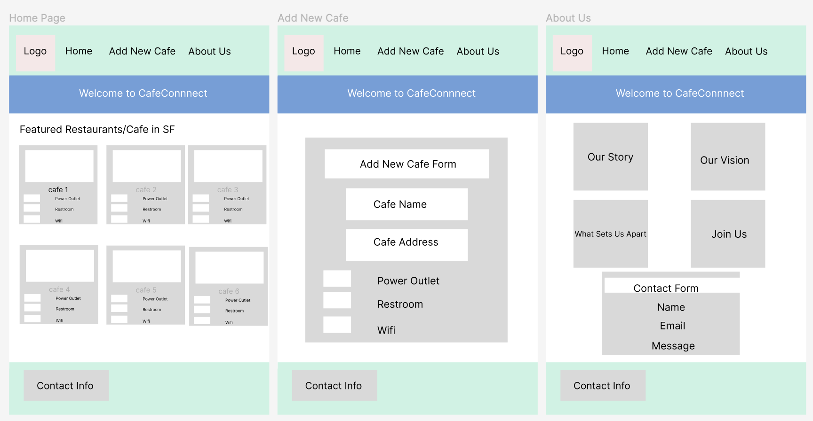

# Design Document of CafeConnect

## Project Description:

- We built an useful website that enable users to easily discover and choose dining destinations based on specific amenities including power outlet, restroom, and wifi.
- Users will have oppportunity to filter existing restaurant/cafe list based on their desired amenities
- Users can contribute data points to the existing cafe list by giving upvotes to amenities of particular cafe
- Allow users to contribute to the list by adding new restaurant in the database

## Functionalities and work division:

- Basic Page Layout: Huiqin Hu
- Restaurant display MongoDB collection: Senay Tilahun
- Add new restaurant form/feature: Huiqin Hu
- Update restaurant amenity info / upvote feature: Senay Tilahun
- Filter restaurant based on amenity: Senay Tilahun
- About Us page and contact form: Huiqin Hu

## User Personas and User Stories:

-Tech-Savvy Traveler: Javier is 33 and is a software engineer. He is a frequent traveler for his tech job. He relies on cafes and restaurants for work and leisure. He values restaurants with reliable Wi-Fi and power outlets to stay productive while on the go.
-Remote Worker: Malik is 27 and is a content creator. He works remotely and frequently works from cafes or eateries. A fast and stable Wi-Fi connection and available power outlets are essential for his content creation. Clean restrooms are important during extended working hours.
-College Student on a Budget: Sofia is 20 and she is a college student. She is ooking for budget-friendly dining options near her campus. She often studies at cafes and eateries, making Wi-Fi availability and power outlets crucial for her academic success. Clean restrooms are also appreciated during long study sessions.

## Mock Up

